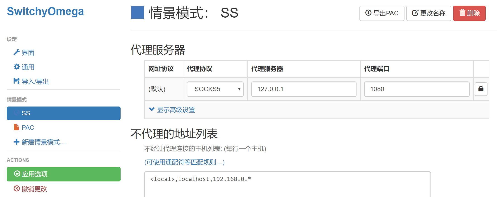
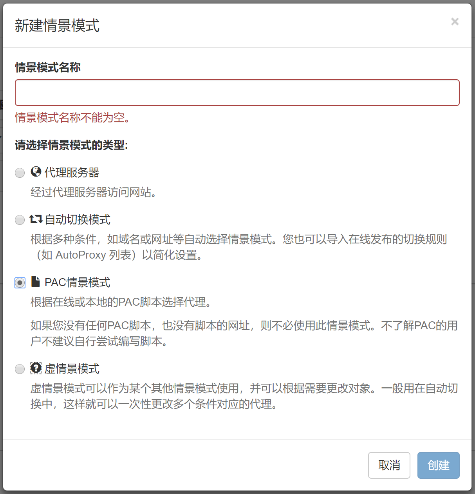
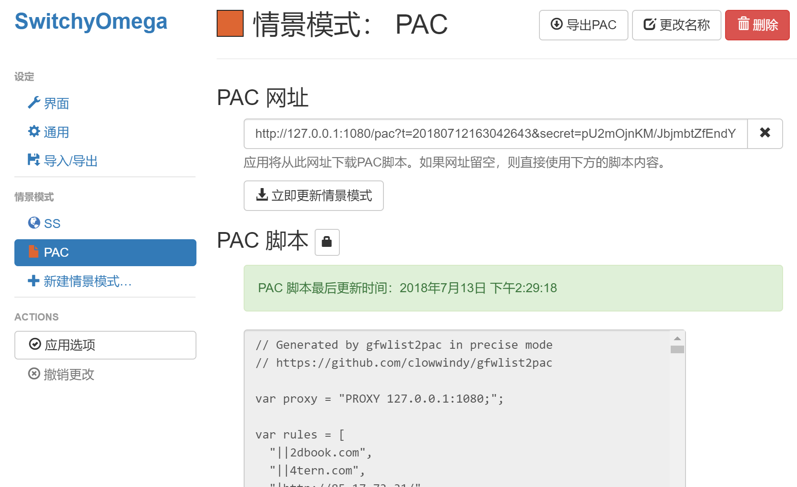
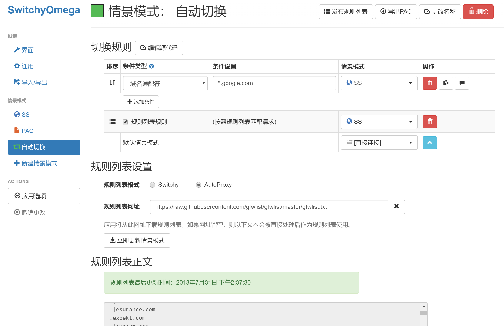
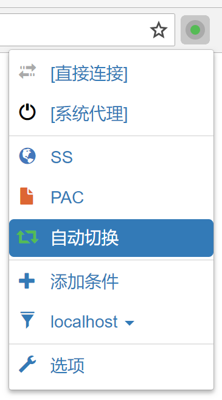

# Chrome

 Chrome 瀏覽器搭配 [Proxy SwitchyOmega](https://switchyomega.com/) 擴充功能使用是非常方便的，此方案需要配合 Shadowsocks 客户端使用，並需要禁用 Shadowsocks 客户端的“啟用系统代理”。

在開始下面的教學前的請確保 Shadowsocks 客户端已经配置好，如果沒有請参考：

#### 在 Windows 中配置 Shadowsocks 客户端



#### 在 macOS 中配置 Shadowsocks 客户端




本教學不適用手機上的 Chrome 瀏覽器。


#### 安装 SwitchyOmega 

[點次下載外掛](https://github.com/FelisCatus/SwitchyOmega/releases/download/v2.5.20/SwitchyOmega_Chromium.crx)或通過 [Chrome 應用商店](https://chrome.google.com/webstore/detail/padekgcemlokbadohgkifijomclgjgif) 線上安装，如果無法訪問，也可以從 Github [直接下载](https://github.com/FelisCatus/SwitchyOmega/releases)安装包

在 Chrome 地址欄输入 `chrome://extensions` 打開擴充功能頁面，拖動 .crx 副檔名的 SwitchyOmega 安裝文件到擴充功能頁面中按提示進行安裝。

#### 配置 Shadowsocks 情景模式 

安装完成後會在 Chrome 瀏覽器右上角顯示擴充功能的圖標，如果你不想瀏覽器走代理可以選擇“直接連接”，如图。

下面開始為 SwitchyOmega 配置 Shadowsocks 代理。首先打開 SwitchyOmega 選項設置界面，如果有教學提示請選擇跳過。

首先我们需要新建一个情景模式，命名为“SS”，並選擇類型為 “代理服务器”，這個模式主要設定為全部都走 Shadowsocks 代理，如圖。

需要配置代理協議：SOCKS5，代理服务器：127.0.0.1，代理端口：1080，如圖。

代理端口需要和上面 Shadowsocks 客户端配置的端口一样，默認情況下代理伺服器地址都是 127.0.0.1。

如果你有使用内網需求可以在 “不代理的地址列表” 排除内網。可以查看上圖中排除 192.168.0.\* 整個網段。

配置完成後請記得 “應用選項” 保存配置。

另外我们需要在新建一个情景模式，命名为“PAC”，並選擇類型為“PAC情景模式”，這個模式主要是走 PAC 自動代理，如圖。

需要先在 Shadowsocks 客户端的選單 “PAC -&gt; 複製本地 PAC 地址”，然後在貼上到 “PAC 網址”中，並立即更新情景模式，更新成功后可以看到下面的“PAC 脚本”會出现內容，如圖。

该模式会根据 PAC 脚本来区分代理，只有规则里面有的才会走代理。

#### 配置自动切换模式 

自动切换模式比较类似上面的“PAC情景模式”，但自动切换模式配置更多，可以自己设置切换规则规则，也可以根据 [GFWList](https://github.com/gfwlist/gfwlist) 生成规则。

在新建情景模式时，类型选择第二个 “自动切换模式”，然后做如下配置：

**切换规则**是在访问条件设置的域名时候使用后面设置的情景模式。比如图中我设置 \*.google.com 使用 SS 情景模式。我们可以点击“添加条件”来添加自己的规则。

将图中 **规则列表规则** 前面的框打√，再将后面的情景模式设置为 SS，意思是规则列表中的内容，我们使用 SS 情景模式。然后规则列表设置中：

> 规则列表格式： AutoProxy   
> 规则列表网址： [https://raw.githubusercontent.com/gfwlist/gfwlist/master/gfwlist.txt](https://raw.githubusercontent.com/gfwlist/gfwlist/master/gfwlist.txt)

输入上面的网址后请点击“立即更新情景模式”，更新成功后可以看到下面的更新时间和内容，这样设置完成 “规则列表规则” 后就不需要在切换规则中一个一个添加条件了。

**切换规则**最后一行的“默认情景模式”代表不在规则列表中网址我们使用“直接连接”情景模式，也就是说不走代理。

配置完成后你可以在 SwitchyOmega 扩展程序菜单中自由选择使用哪种情景模式，如图。

#### 测试代理 

使用 [IP125.com](https://www.ip125.com/) 查看访问国内外时的 IP 地址。


Happy End 您可以愉快的使用了！


