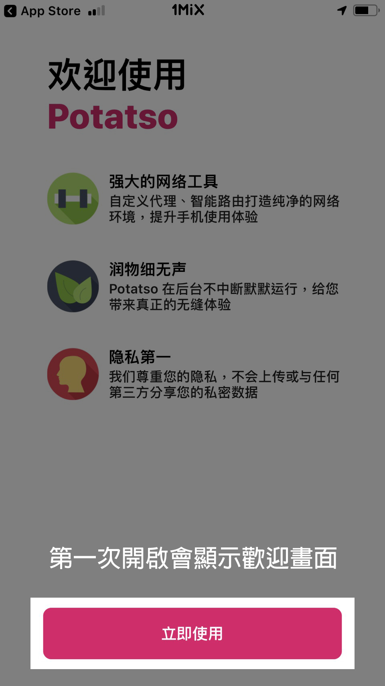

# Potatso Lite

* `系统要求：iOS 9 及以上`
* `軟體版本：Shadowrocket 最新版`
* `設備要求：iPhone / iPad`

前往App Store搜尋下載Potatso Lite

下載完後打開Potatso Lite，第一次使用會顯示歡迎畫面

打開Safari，登入到1MiX 的用戶中心複製訂閱網址

第一次使用請點擊Allow，往後使用只需打開app點擊開始即可


Happy End 您可以愉快的使用了！


