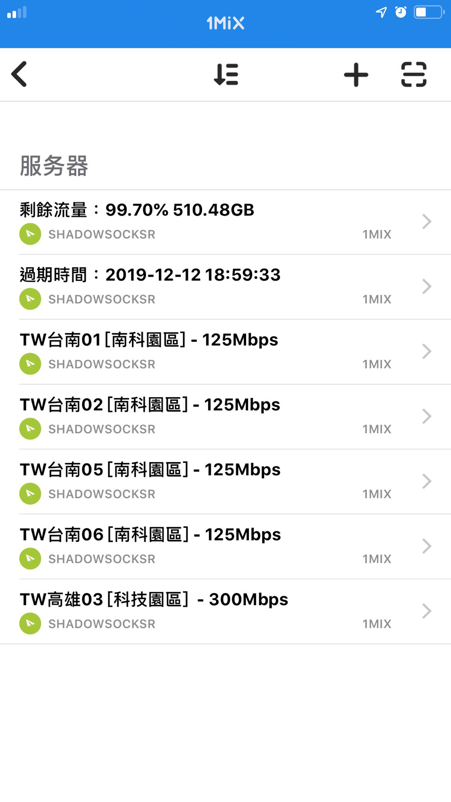
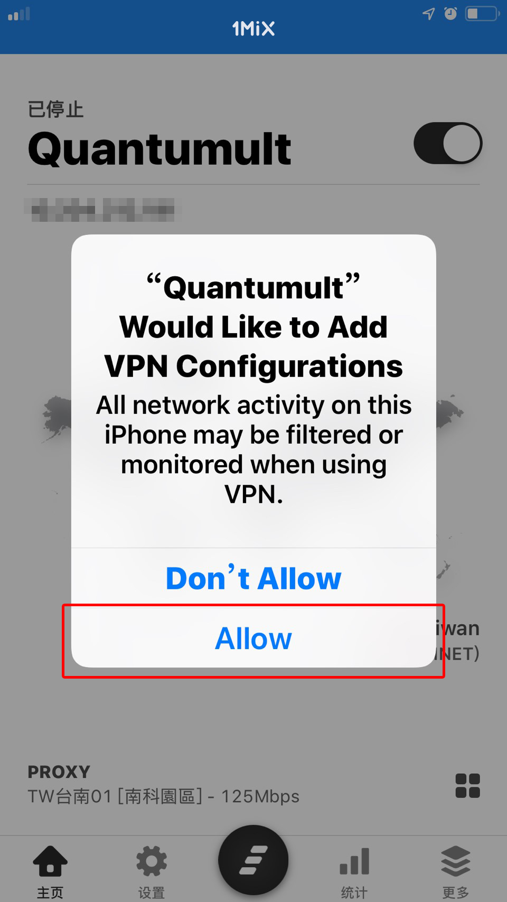

# Quantumult

* `軟體名稱：Quantumult`
* `系统要求：iOS 9 及以上`
* `軟體版本：Quantumult 最新版`
* `設備要求：iPhone / iPad`

**下載應用**

在App Store搜索`Quantumult`即可購買（此教學製作時候，售價為170元台幣）和下載。



打开 Quantumult，点击底部的「Settings」进入设置页面。

### 方法一 訂閱方式

點擊「Favorites」 進入訂閱管理頁面，然後點擊右上角的「+」。

### 更新訂閱

### 開始使用


Happy End 您可以愉快的使用了！


### 切換模式

* 全局代理 - 所有流量皆透過伺服器。
* 自動分流 - 智能分流內地APP、網站不通過伺服器。
* 全局直連 - 不通過伺服器。

### 方法二 手動添加

在弹出的菜单中选择「Server」，在新的页面中，点击 「Name」，输入 1mix 并保存，然后点击 「URL」，将订阅地址粘贴进去，并勾选下方的「Delete Option」。

添加完成后，会自动返回订阅管理页面，这时在 Server 分类下名称为的选项上向左轻扫，点击「Update」即可获取节点列表。


Happy End 您可以愉快的使用了！


