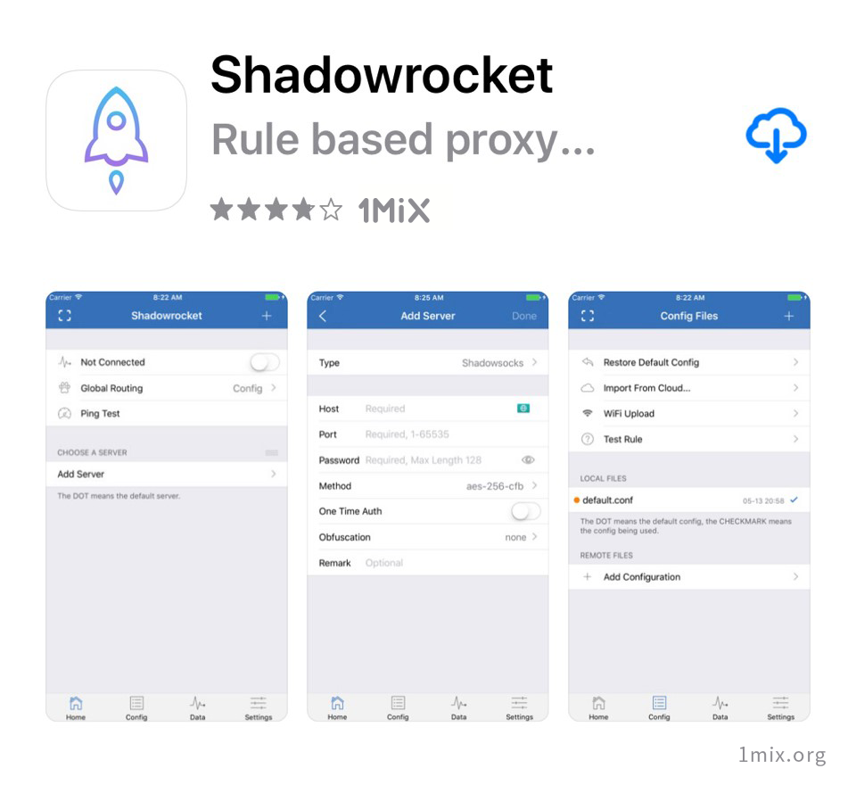
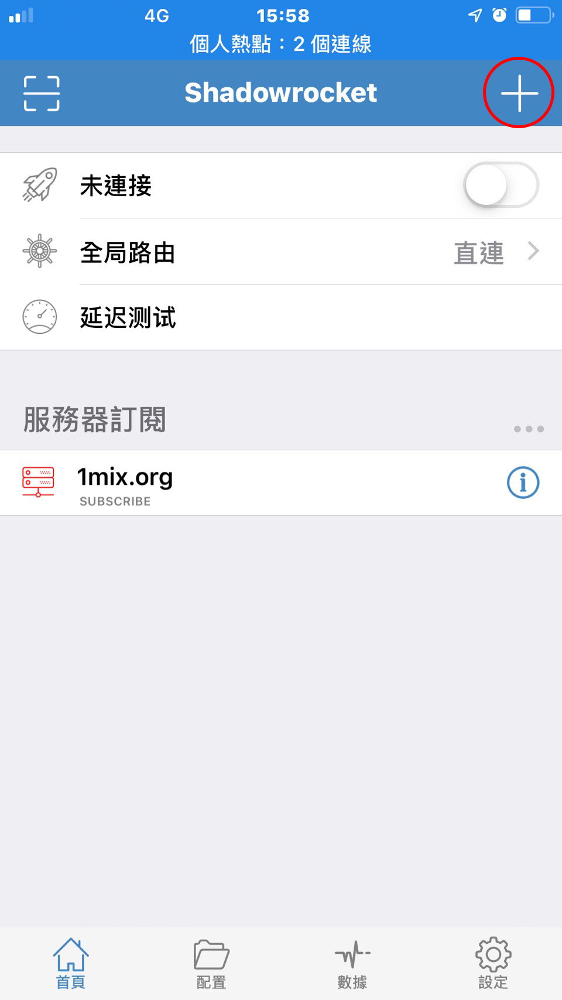
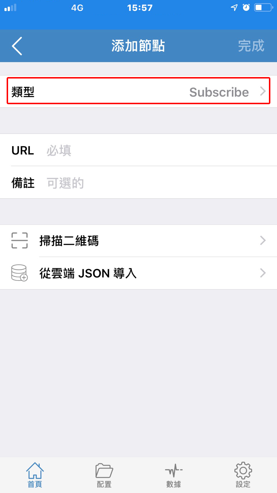
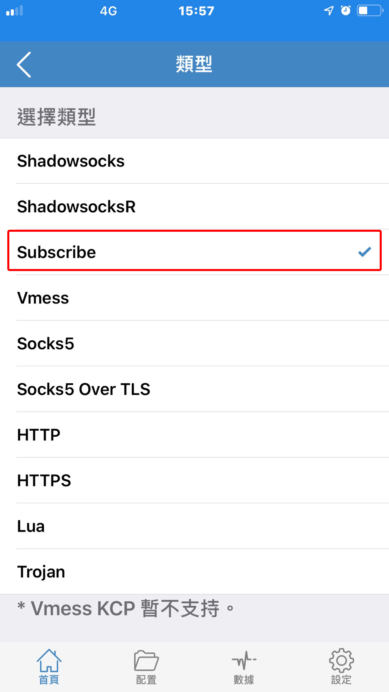
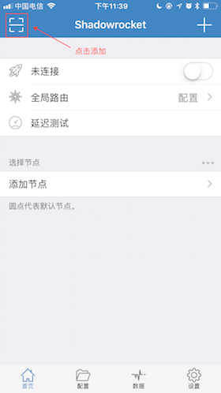
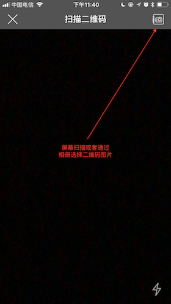
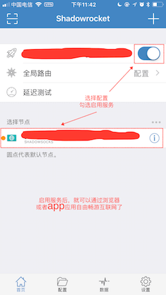
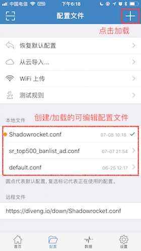
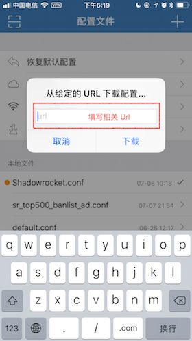

# Shadowrocket

### 說明

* `軟體名稱：Shadowrocket`
* `系统要求：iOS 9 及以上`
* `軟體版本：Shadowrocket 最新版`
* `設備要求：iPhone / iPad`


此應用已在国区下架，直接搜尋會出現盜版不可用的「Shadowrkcoet」僅仿詐騙。

（可以在 使用非中國區商店頁面獲取）


Shadowrocket能支持SSR網絡混淆的高級特性（protocol和obfs），後續我們的服務也會支持更多定制（ssr）。

### **下載應用**

但是因為其已經不在中國區App Store上架，需要在外國區的App Store下載，以及因為其靈活的自定義能力，使用Shadowrocket適合一些動手能力較強以及有較高定制需求的用戶。



### **方法一 訂閱方式**

打開 Shadowrkcoet，點擊首頁的右上角的「+」

點擊類型

選擇「Subscribe」，將訂閱地址複製的内容填入「URL」右邊的編輯框，點擊完成。


Happy End 您可以愉快的使用了！


### 更新訂閱

### 方法二 手動添加

使用掃描二維碼方式添加伺服器，需要一個一個掃描，且無法快速更新伺服器設置，較不推薦此方式，使方式建議在訂閱無法自動更新時使用。

### 設定規則配置文件

 默認Shadowrocket只能全局使用代理，如果想要更靈活，需要自行定制規則。當然，也可以參考[別人整理好的規則](https://github.com/h2y/Shadowrocket-ADBlock-Rules)，然後在App中通過規則文件url來加載相關的規則，


Happy End 您可以愉快的使用了！


