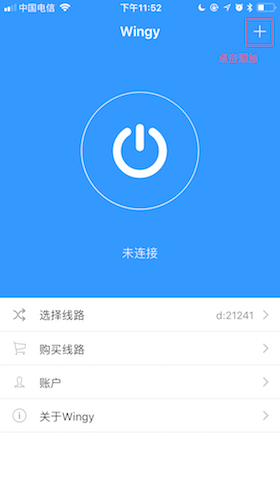
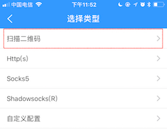
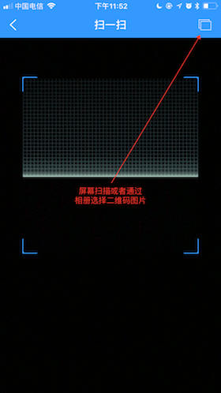
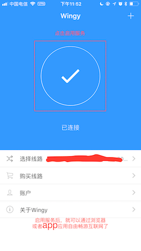
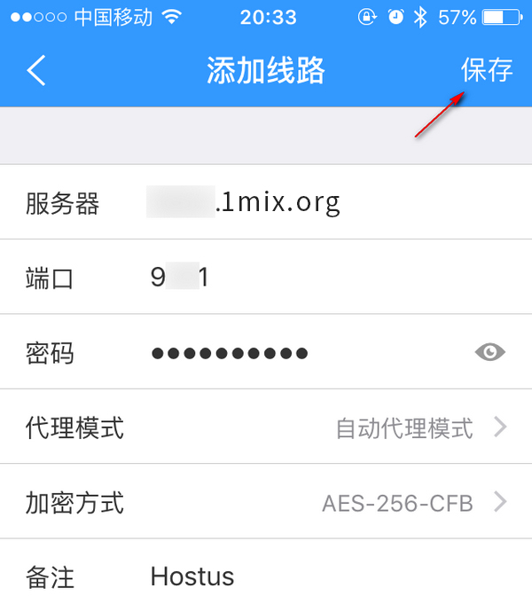
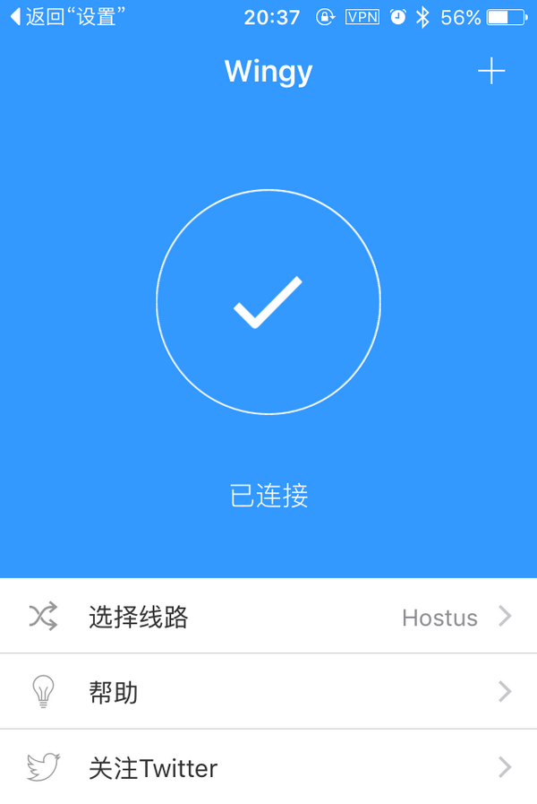

# Wingy

Wingy 客戶端配置使用簡單而且免費，可惜的是，因為其已經不在中國區App Store 上架，需要在外國區的App Store 下載


Wingy 不支持SSR 網絡混淆的高級特性（protocol 和obfs）。


#### 下載安裝Wingy

Wingy是IOS系統中同時支持Shadowsocks/ShadowsocksR的APP之一，目前收費1美元，您可以直接在蘋果App Store直接搜尋進行安裝，如下截圖。

#### Wingy開始配置

**方法一：掃描二維碼配置推薦**

**方法二：手動輸入配置，不適合新手，錯一個字都造成無法連接**

打開Wingy，選擇線路-&gt; 新增線路-&gt; Shadowsocks -&gt; 填寫服務器、端口、密碼等訊息，然後保存，如下截圖。

保存後回到主界面，選擇線路任意線路，如果第一次連接可能會要求設置Touch ID，直接錄入指紋即可，不出意外就會看到連接成功的截圖。

