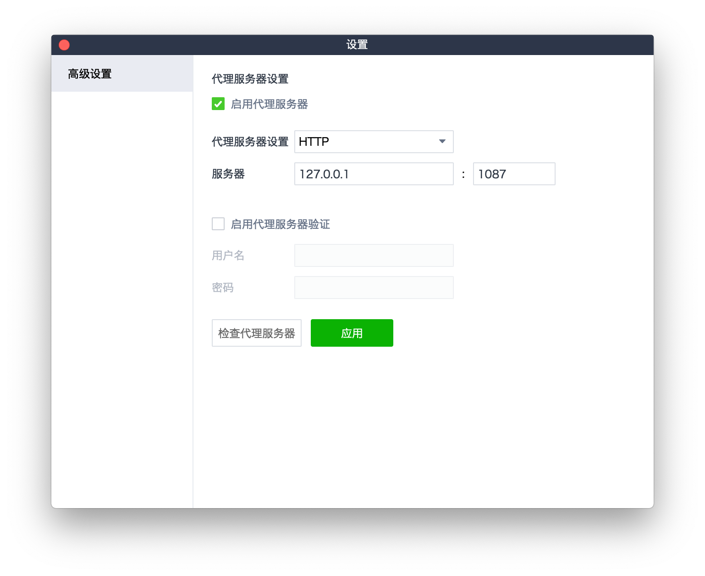

# LINE 桌面版

Windows 和Mac 上的SSR 客戶端默認只代理瀏覽器（包括內置瀏覽器應用）的流量，如果想要代理其它應用程序，還需要手動設置代理服務器，本文以LINE 為例：

1. 運行「SSR 客戶端」，確保可以正常訪問Google、Youtube、Facebook 等網站。
2. 選取「LINE 桌面版」&gt;「設置」。
3. 選中「啟用代理服務器」，代理服務器設置為「HTTP」，輸入服務器和端口：
   * 在Mac 上使用HTTP 代理：127.0.0.1:1087
   * 在Mac 上使用SOCKS5 代理：127.0.0.1:1086
   * 在Windows 上使用HTTP 代理：127.0.0.1:1080
   * 在Windows 上使用SOCKS5 代理：127.0.0.1:1080
4. 點擊「檢查代理服務器」，如果提示代理服務器已可以使用，則點擊「應用」。

