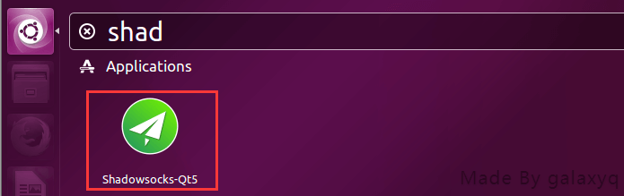
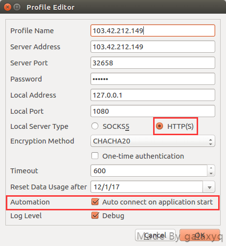
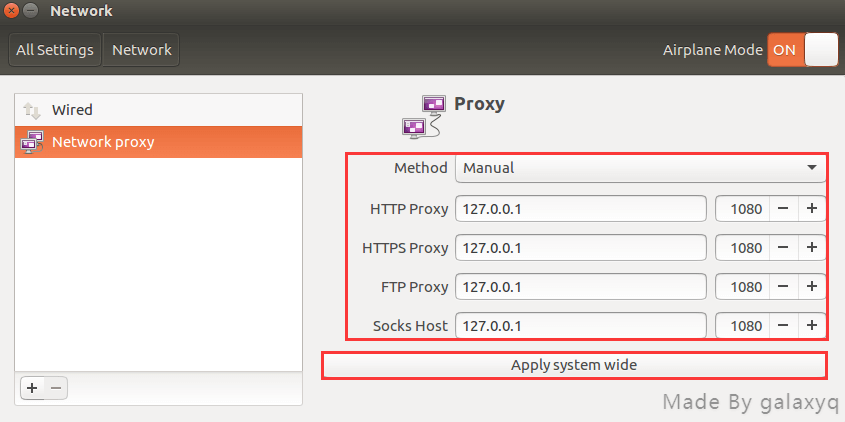
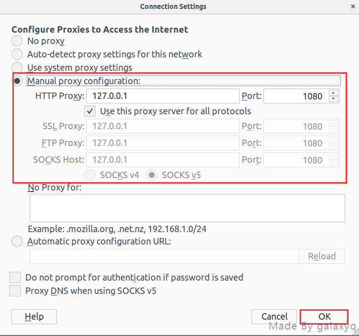
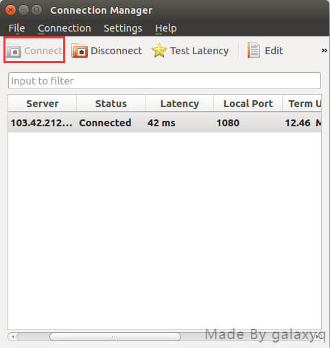

# Ubuntu

shadowsocks-qt5是ubuntu上一個可視化的版本

**安裝shadowsocks-qt5**

```text
1.$ sudo add-apt-repository ppa:hzwhuang/ss-qt5
2.$ sudo apt-get update
3.$ sudo apt-get install shadowsocks-qt5
```

**如果安裝成功之後，按win鍵搜索應該能夠找到軟件，如下圖所示：**



**配置shadowsocks-qt5**

填寫對應的服務器IP，端口，密碼，加密方式請依照網站做相同設定，紅色標註地方請與圖片一樣



**配置系統代理模式**



**配置瀏覽器代理模式（本次為Ubuntu自帶FireFox瀏覽器為例）**



**連接並開始上網**



