# ShadowsocksX-NG

* `系统要求：macOS 10.5 及以上`
* `軟體版本：ShadowsocksX-NG-R8 1.4.4`
* `設備要求：MacBook / iMac / Mac Pro`

登入帳號，用戶中心底部[下载](http://1mix.org/user)並安装完成後，打開dmg文件，然後將其拖動到右側的Applications安裝。

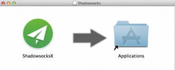

安裝完成後，從LaunchPad或應用程序中打開，系統右上角會出現小飛機標誌。

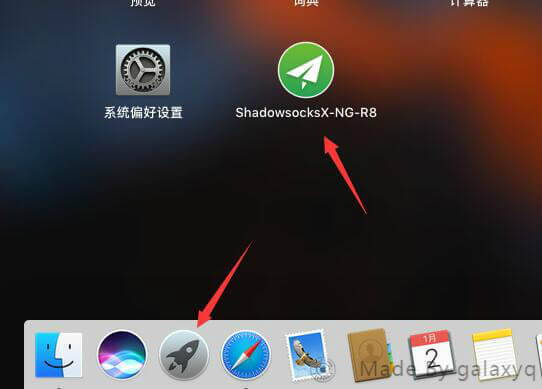

如提示不安全，请到系统偏好设置打开程式

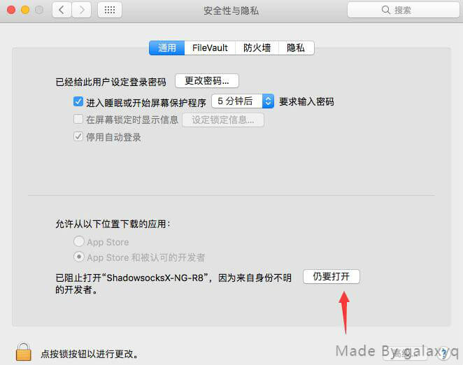

點擊小飛機打開菜單——服務器——編輯訂閱：

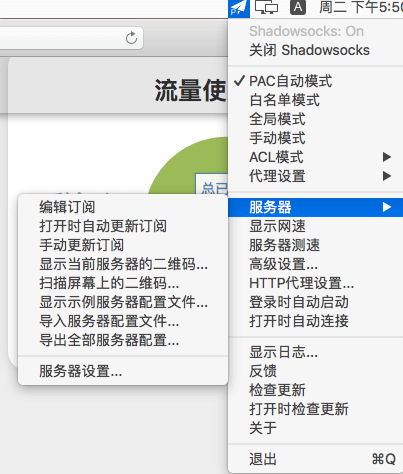

點擊+號後填入訂閱地址後手動更新訂閱

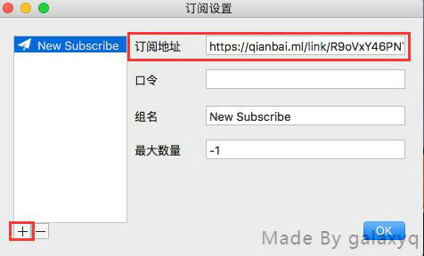

右上角会显示「成功更新订阅」

服務器添加成功後，選擇代理方式為繞過中國IP。或者也可以選擇PAC自動模式，前提是先點擊GFW List更新PAC，更新成功後，設置為PAC自動模式。

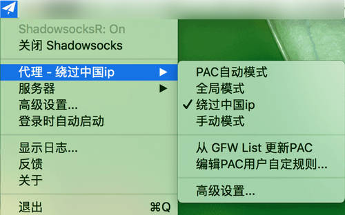

選擇一個節點

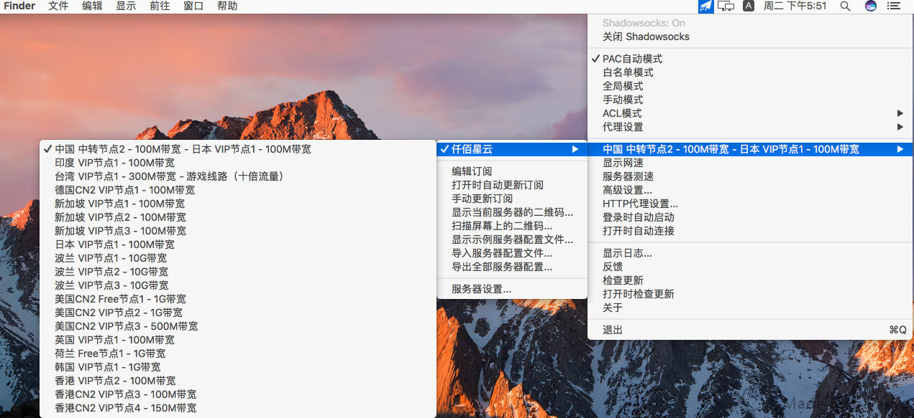

即可正常使用


手動新增伺服器方式，不建議新手使用!


點擊小飛機打開菜單——服務器——服務器設置：

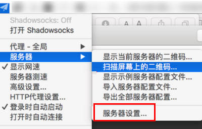

在接下來的窗口中，點擊左下側的 + 號，然後在右側設置服務器參數，下圖紅框內容為必填項。

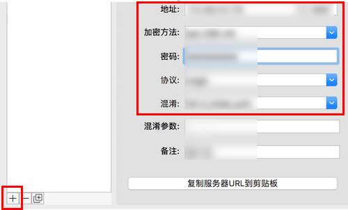

地址：即網站服務器的IP地址，填好IP地址後，在後面的小框內填入服務端口。  
加密方法：與服務端設置的Stream Cipher參數保持一致。  
密碼：填入服務端設置的密碼。  
協議：與服務端設置的Protocol參數保持一致。  
混淆：與服務端設置的obfs參數保持一致。  
混淆參數：一般默認為空。


相關數據請登入網站後查看節點列表



Happy End 您可以愉快的使用了！


### 新版macOS 無法更新訂閱 問題解決辦法

新版mac系統因為新增 App Transport Security \(ATS\)機制關係，HTTP都轉向TLS1.2協議進行傳輸會導致原來請求更新訂閱網址，非HTTPS訪問是禁止的，照下面操作方法修改APP即可正常更新訂閱 \(本教學由1MiX撰寫真正實力技術派，轉貼請註明\)。

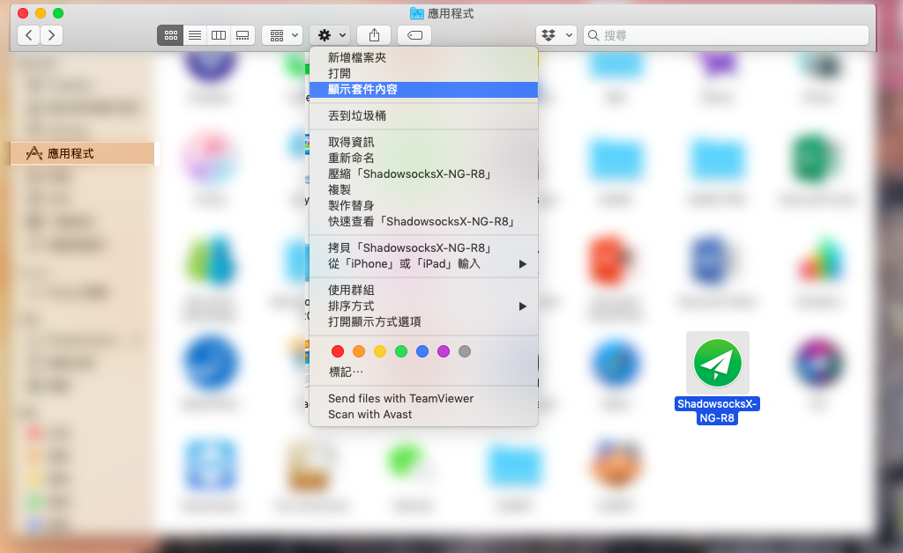

到 應用程式 找到 ShadowsocksX-NG-R8 應用程式，右鍵 &gt; 顯示套件內容  或 齒輪 &gt; 顯示套件內容

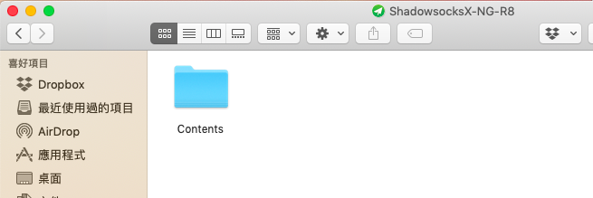

[點此下載](http://1mix.org/ssr-download/Info.zip) Info.plist 文件壓縮檔 

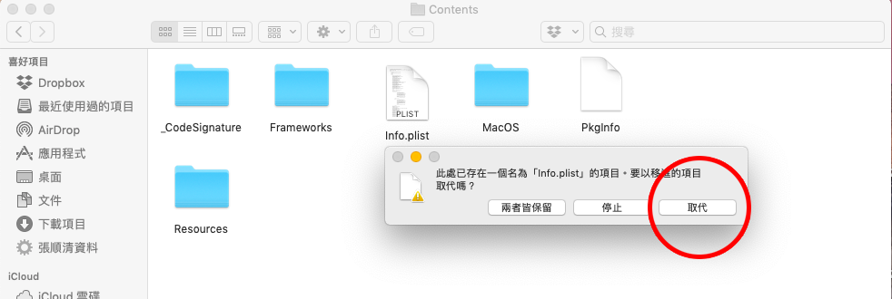

打開下載下來的壓縮檔，將Info.plist 檔案拖曳進去，**取代**

重新打開app 即更新訂閱成功

### 閃退開不起來 解決辦法

一般開啟來程式及閃退，是因為之前有使用過，設定不良導致

在 Finder 中，選擇「前往 > 移至資料夾」。

在「移至資料夾」對話框中，鍵入 ~/Library

按一下「前往」。

刪除
/Users/{Your user name}/Library/Preferences/com.qiuyuzhou.ShadowsocksX-NG.plist
重新安裝一次軟體 即可

另外也可以檢查是否有殘餘資料夾
/Users/{Your user name}/.ShadowsocksX 
