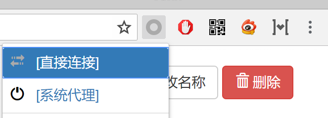
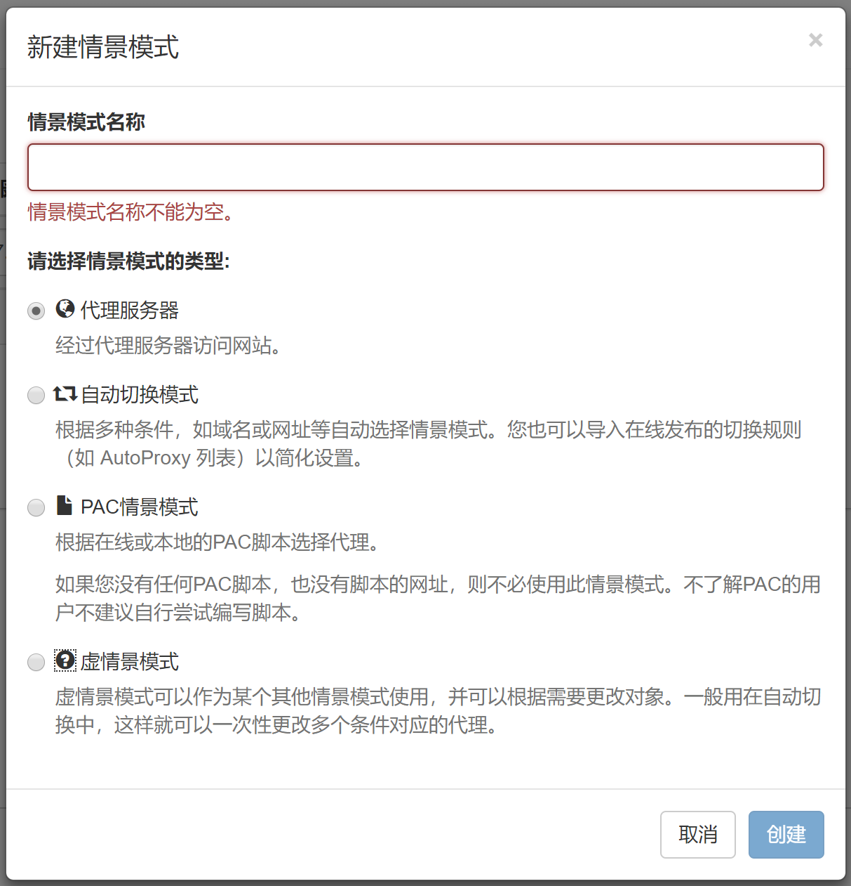
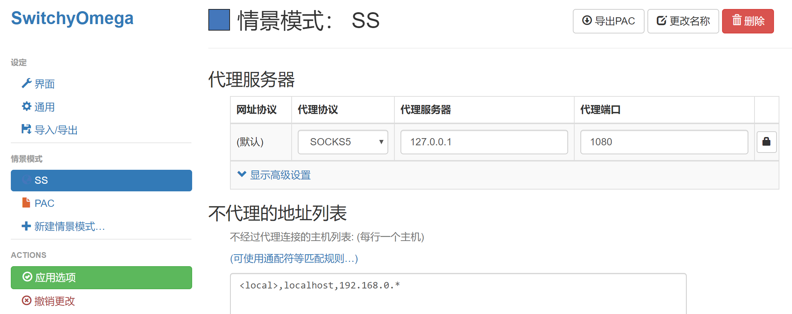
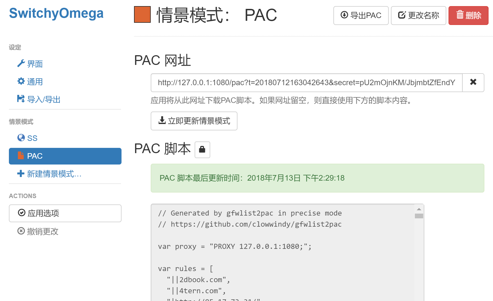
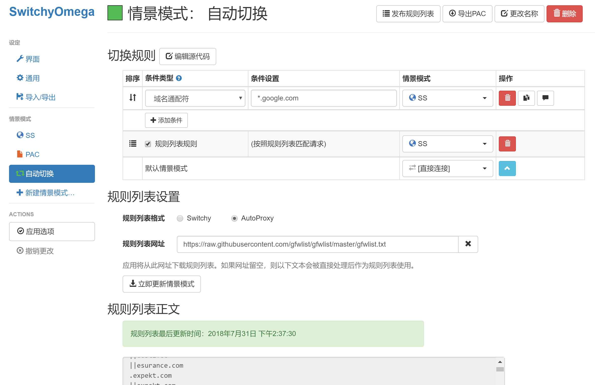

# Chrome

 Chrome 浏览器搭配 [Proxy SwitchyOmega](https://switchyomega.com/) 扩展使用是非常方便的，此方案需要配合 Shadowsocks 客户端使用，并需要禁用 Shadowsocks 客户端的“启用系统代理”。

在开始下面的教程前的请确保 Shadowsocks 客户端已经配置好，如果没有请参考：

* 在 Windows 中配置 Shadowsocks 客户端
* 在 macOS 中配置 Shadowsocks 客户端

本教程不适用手机上的 Chrome 浏览器。

#### 安装 SwitchyOmega 

通过 [Chrome 应用商店](https://chrome.google.com/webstore/detail/padekgcemlokbadohgkifijomclgjgif) 在线安装，如果无法访问，也可以从 Github [直接下载](https://github.com/FelisCatus/SwitchyOmega/releases)安装包

在 Chrome 地址栏输入 `chrome://extensions` 打开扩展程序，拖动 .crx 后缀的 SwitchyOmega 安装文件到扩展程序中按提示进行安装。

#### 配置 Shadowsocks 情景模式 

安装完成后会在 Chrome 浏览器右上角显示扩展程序的图标，如果你不想浏览器走代理可以选择“直接连接”，如图。

下面开始为 SwitchyOmega 配置 Shadowsocks 代理。首先打开 SwitchyOmega 选项设置界面，如果有教程提示请选择跳过。

首先我们需要新建一个情景模式，命名为“SS”，并选择类型为 “代理服务器”，这个模式主要设置为全部都走 Shadowsocks 代理，如图。

需要配置代理协议：SOCKS5，代理服务器：127.0.0.1，代理端口：1080，如图。

代理端口需要和上面 Shadowsocks 客户端配置的端口一样，默认情况下代理服务器地址都是 127.0.0.1。

如果你有使用内网的需求可以在 “不代理的地址列表” 排除内网。可以查看上图中排除 192.168.0.\* 整个网段。

配置完成后请记得 “应用选项” 保存配置。

另外我们需要在新建一个情景模式，命名为“PAC”，并选择类型为“PAC情景模式”，这个模式主要是走 PAC 自动代理，如图。

需要先在 Shadowsocks 客户端的菜单 “PAC -&gt; 复制本地 PAC 地址”，然后在粘贴到 “PAC 网址”中，并立即更新情景模式，更新成功后可以看到下面的“PAC 脚本”会出现内容，如图。

该模式会根据 PAC 脚本来区分代理，只有规则里面有的才会走代理。

#### 配置自动切换模式 

自动切换模式比较类似上面的“PAC情景模式”，但自动切换模式配置更多，可以自己设置切换规则规则，也可以根据 [GFWList](https://github.com/gfwlist/gfwlist) 生成规则。

在新建情景模式时，类型选择第二个 “自动切换模式”，然后做如下配置：

**切换规则**是在访问条件设置的域名时候使用后面设置的情景模式。比如图中我设置 \*.google.com 使用 SS 情景模式。我们可以点击“添加条件”来添加自己的规则。

将图中 **规则列表规则** 前面的框打√，再将后面的情景模式设置为 SS，意思是规则列表中的内容，我们使用 SS 情景模式。然后规则列表设置中：

> 规则列表格式： AutoProxy   
> 规则列表网址： [https://raw.githubusercontent.com/gfwlist/gfwlist/master/gfwlist.txt](https://raw.githubusercontent.com/gfwlist/gfwlist/master/gfwlist.txt)

输入上面的网址后请点击“立即更新情景模式”，更新成功后可以看到下面的更新时间和内容，这样设置完成 “规则列表规则” 后就不需要在切换规则中一个一个添加条件了。

**切换规则**最后一行的“默认情景模式”代表不在规则列表中网址我们使用“直接连接”情景模式，也就是说不走代理。

配置完成后你可以在 SwitchyOmega 扩展程序菜单中自由选择使用哪种情景模式，如图。

#### 测试代理 

使用 [IP125.com](https://www.ip125.com/) 查看访问国内外时的 IP 地址。

