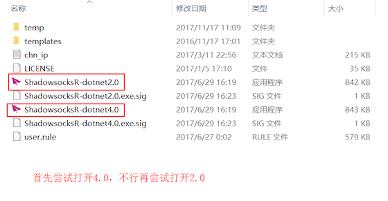
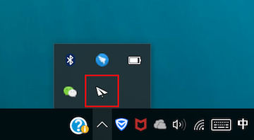
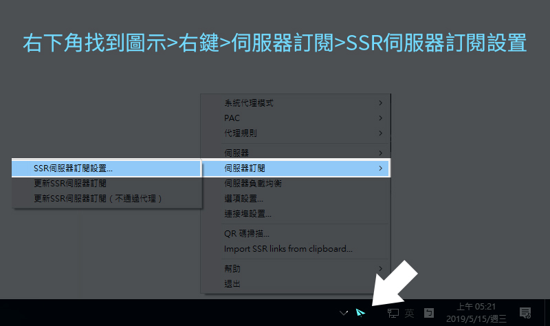
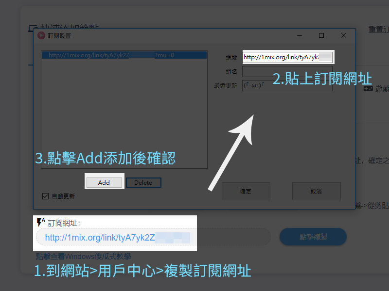
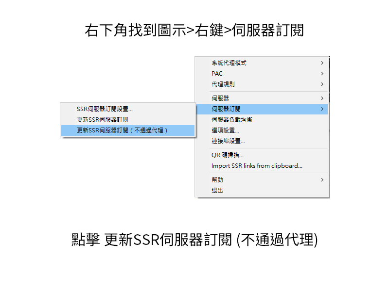
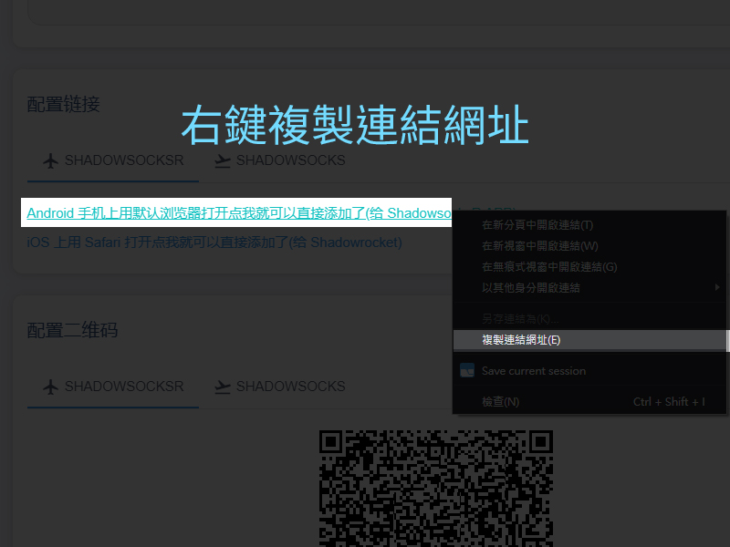
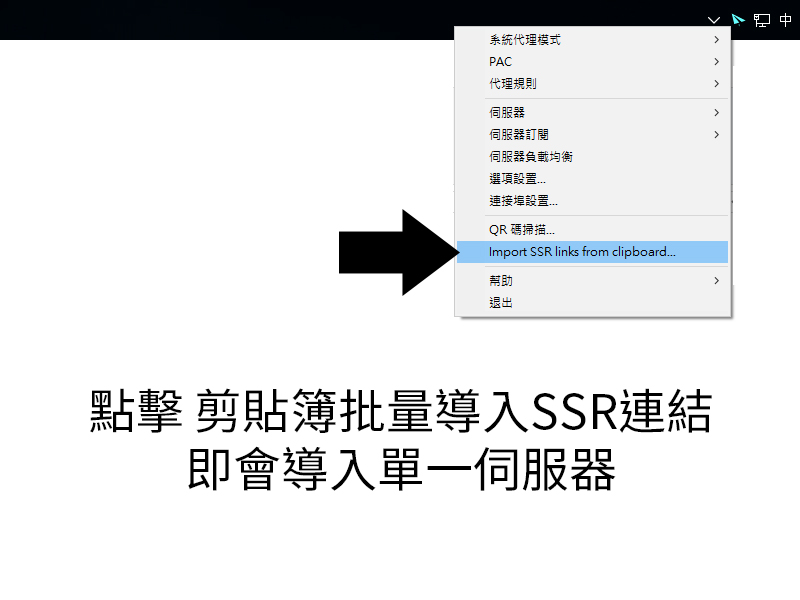
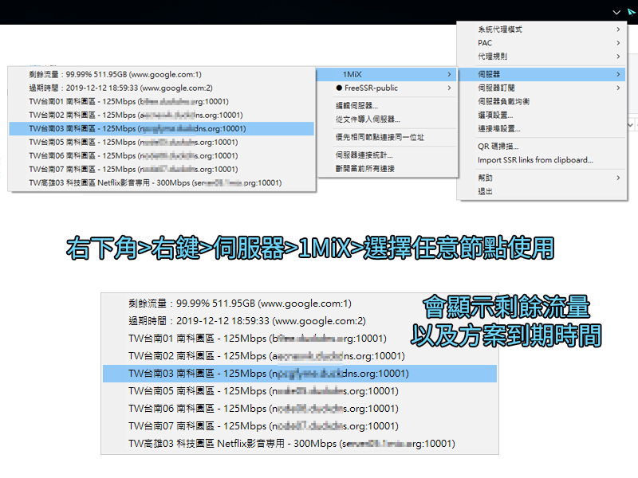

# ShadowsocksR

* `系统要求：Windows XP 及以上`
* `软件版本：ShadowsocksR 最新版`
* `设备要求：Windows PC / Tablet`

### 下載

Windows的加速軟體 \( 請登入網站用戶中心 \)，下載後解壓到一個文件夾中，然後就可以運行軟件。

然後，嘗試再打開軟件。

 打開軟體後，可以在右下角的程序欄中找到，右鍵`小飞机图标`能彈出菜單。

### 方法一 訂閱方式 

然后右鍵點擊工作列纸飛機圖標，在「伺服器」選項卡中選擇「SSR 伺服器訂閱設置」。

在彈出的窗口中，點擊 Add 按鈕，將訂閱地址粘貼於右側的輸入框中，然後勾選「自動更新」複選框，點擊「確定」。

再次右鍵點擊托盤欄紙飛機圖標，在「服務器」選項卡中選擇「更新 SSR 服務器訂閱（不通過代理）」

等待幾秒後（具體時間取決於您的網絡環境），您將會收到「服務器訂閱更新成功」的通知消息，同時查看服務器列表也可以看到「1MiX」節點。


Happy End 您可以愉快的使用了！


### 方法二  手動添加


Happy End 您可以愉快的使用了！


### 其他設置


客户端配置


右键点击托盘栏纸飞机图标，在「代理规则」菜单中选择「绕过局域网和大陆」。

再次右键点击托盘栏纸飞机图标，在「系统代理模式」菜单中选择「PAC 模式」或「全局模式」。


ShadowsocksR for Windows 的「负载均衡」会导致 IP 频繁跳动导致部分服务不可用，出现此情况请关闭「负载均衡」。


