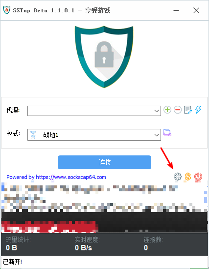
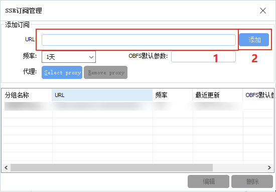
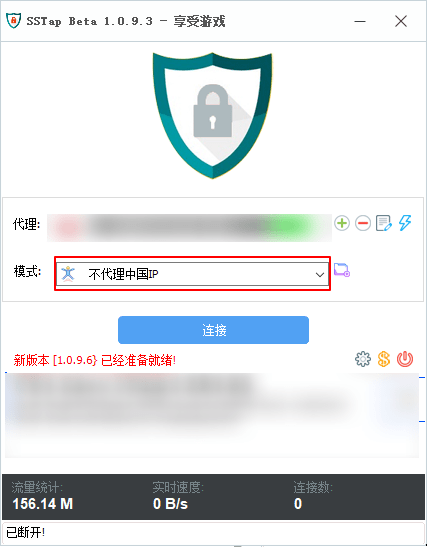

# SS-Tap（遊戲/特殊）

* `系统要求：Windows 7 及以上`
* `软件版本：SSTap Beta 1.0.9.3 及以上`
* `设备要求：Windows PC / Tablet`


尽管 SS-Tap 宣称为游戏而生，但 SS / SSR 项目却并非为游戏设计的，其设计结构和很多代码实现都并不能提供足够优秀的游戏性能，1MiX 仍然建议有游戏加速需求的用户使用专业的游戏加速器，

此外，如果你有使用 BitTorrent 协议的需求（各类 BT/PT 下载），则应当避免在使用这些软件时开启 SS-Tap，否则 BitTorrent 流量将有极大可能被 SS-Tap 路由通过 1MiX 网络，而 1MiX 的条款和条件中明确指出不允许在 1MiX 网络上使用 BitTorrent 协议，否则将暂时或永久限制订阅或账户访问。

作者 Taro 宣称 SS-Tap 的代码没有备份，而储存代码的硬盘因为控制芯片损坏，永久丢失了这些代码，并决定放弃 SS-Tap 的开发，因此，SS-Tap 将可能在未来的系统更新中出现意料之外的问题或无法使用。


[下载](https://www.sockscap64.com/sstap-%E4%BA%AB%E5%8F%97%E6%B8%B8%E6%88%8F-%E4%BD%BF%E7%94%A8sstap/)並安裝，安裝過程中將可能提示，無需擔心，這是因為SS-Tap需要使用OpenVPN的TAP設備驅動來創建虛擬網卡以實現類似VPN的效果。為了SS-Tap能正常運行，請點擊「安裝」。

打開 SS-Tap，在主界面如圖所示位置點擊齒輪圖標（SSTap的運行需要管理員權限）

在彈出的菜單中選擇「SSR 訂閱」 - 「SSR 訂閱管理」，在新的窗口中，將訂閱地址粘貼到「URL」右邊的編輯框內，然後點擊「添加」。

操作完成後，關閉SSR訂閱管理的窗口，等待幾秒後（具體時間取決於您的網絡環境），您將看到「1MiX」節點列表，然後在「代理」中選擇所需的節點，然後根據需求在「模式」中選擇所需的模式


「1MiX」的節點均沒有為遊戲加速優化，因此我們不對遊戲加速性能提供任何保障。


